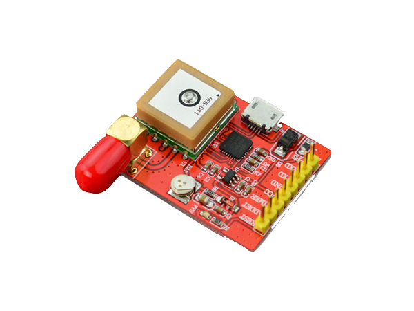
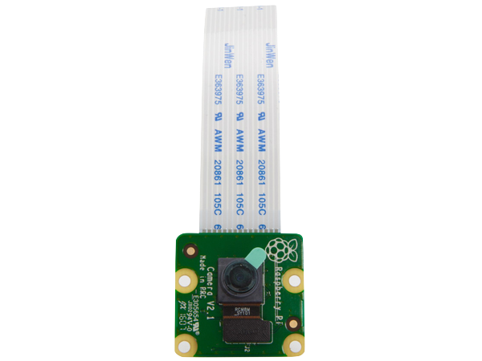
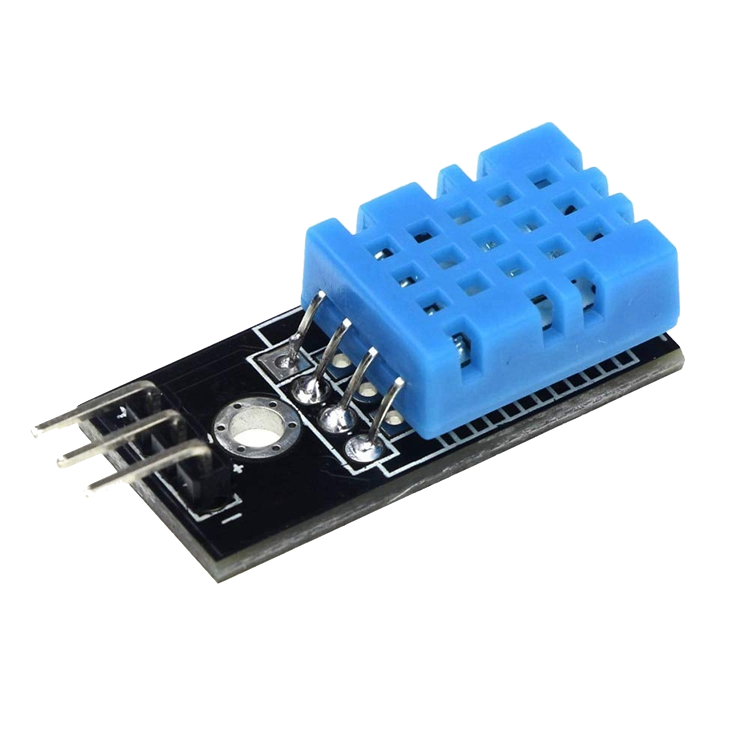
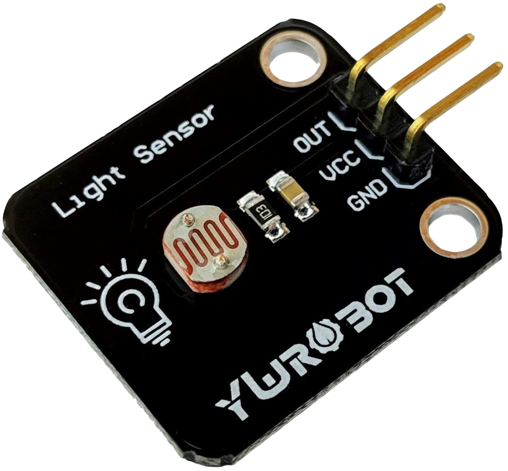
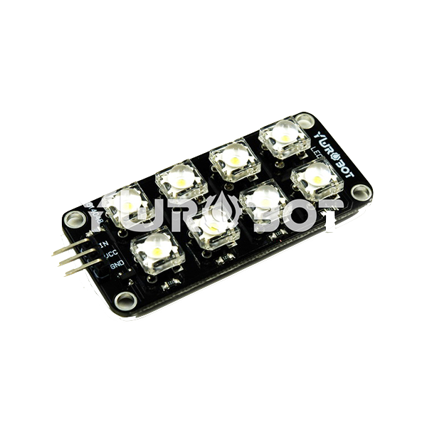
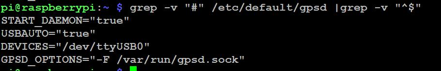

# AirPost_Station

AirPost_Station is a IOT platform based landing space for drone.

## Companion Computer

+ Raspberry Pi

## Sensors

+ USB-Port-GPS Module SKU:EZ-0048

  

  To specify station coordination through gps.

  [Wiki](https://wiki.52pi.com/index.php/USB-Port-GPS_Module_SKU:EZ-0048)

  [Product Link](https://www.devicemart.co.kr/goods/view?no=1360762)

+ Raspberry Pi Camera Module V2

  

  To measure cleaerence of landing space

  [Product Link](https://www.devicemart.co.kr/goods/view?no=1077951&gclid=CjwKCAjwi9-HBhACEiwAPzUhHM7rQAiEkU7HuskD-cf6QS4HtQLyge0wrAJ1CSpK6Mnv74iOIMtgExoCfRQQAvD_BwE)

+ DHT11 Temperature, Humid Sensor

  

  To measure status of landing space.

  [Product Link](https://www.alibaba.com/product-detail/DHT11-Temperature-and-Relative-Humidity-Sensor_60715089558.html)

+ Light Sensor

  

  To measure light value of landing space. Sensor value used for actuating LED to ensure landing space visibility at night.

  [Product Link](https://www.amazon.com.au/YwRobot-Light-Sensor-Module-Photoresistor/dp/B07B47VVGY)

## Actuators

+ LED

  

  [Product Link](https://www.devicemart.co.kr/goods/view?no=1384418)

## Communication Method

+ MQTT

  Between sink node server and station

+ GPIO

  Between companion computer and sensors

## Guide

+ Run
  + type following command ```python3 run.py```

+ Packages

+ GPS

  + Preparing

    1. install packages for GPS module.
       
       `sudo apt-get update && sudo apt-get -y install gpsd gpsd-clients python-gps`
       
       `pip3 install gps`
       
    2. Start the gpsd service and control it.

       Enable it: `sudo systemctl enable gpsd.socket`

       Start it: `sudo systemctl start gpsd.socket`

       Restart it: `sudo systemctl restart gpsd.socket`

       Check status: `sudo systemctl status gpsd.socket`

    3. Modify the configuration file of gpsd in /etc/default/gpsd
       Modify the "DEVICE" parameter according to the name of serial port in /dev folder.
       It is usually named "/dev/ttyUSB0" if you connect it to Raspberry Pi via USB cable.
       You can use "nano" or "vim.tiny" editor to finish it.

       

    4. Restart service:
       `sudo systemctl restart gpsd.socket`

       Finally, use this command to get information from GPS module.
       `sudo cgps -s`

+ Camera

  + Preparing

    - Camset
      1. enable rasberry pi camera in `sudo raspi-config`
      2. `sudo vim /etc/modules` and add `bcm2835-v4l2` below

    + opencv-python

      1. install dependent packages

      2. ```
         sudo apt-get update && sudo apt-get upgrade -y
         sudo apt-get install build-essential cmake pkg-config -y
         sudo apt-get install libjpeg-dev libtiff5-dev libjasper-dev libpng-dev -y
         sudo apt-get install libavcodec-dev libavformat-dev libswscale-dev libv4l-dev -y
         sudo apt-get install libxvidcore-dev libx264-dev -y
         sudo apt-get install libfontconfig1-dev libcairo2-dev -y
         sudo apt-get install libgdk-pixbuf2.0-dev libpango1.0-dev -y
         sudo apt-get install libgtk2.0-dev libgtk-3-dev -y
         sudo apt-get install libatlas-base-dev gfortran -y
         sudo apt-get install libhdf5-dev libhdf5-serial-dev libhdf5-103 -y
         sudo apt-get install libqtgui4 libqtwebkit4 libqt4-test python3-pyqt5 -y
         sudo apt-get install python3-dev -y
         ```

      3. install opencv-python with pip3

         `sudo pip install opencv-contrib-python==4.1.0.25`

    + [apriltag](https://github.com/AprilRobotics/apriltag.git)

      ```
      cd Requirements/apriltag
      cmake .
      sudo make install
      ```

    + other packages

      ```
      pip install Cython
      pip install --upgrade imutils
      # Update pip
      python -m pip install -U pip
      # Install scikit-image
      python -m pip install -U scikit-image
      ```

  + Preparing

    + py-spidev

      ```
      cd py-spidev/
      sudo python setup.py install
      ```
      
+ TempHumid Sensor

  + Prepareing

    + Adafruit_DHT

      ```
      sudo python3 -m pip install --upgrade pip setuptools wheel
      sudo pip3 install Adafruit_DHT
      ```

    + python board package

      `pip3 install board`


+ MQTT client

  + mosquitto-client python

    ```
    sudo apt-get install build-essential libc-ares-dev uuid-dev libssl-dev libcurl4-openssl-dev libmysqlclient-dev
    sudo apt-get install mosquitto-clients
    pip3 install paho-mqtt
    ```
      

## Reference Link

- [Gps Wiki](https://wiki.52pi.com/index.php/USB-Port-GPS_Module_SKU:EZ-0048)
- [Raspberry Pi Camera Setting](http://www.3demp.com/community/boardDetails.php?cbID=236)

- [Opencv raspberry pi camera streaming](https://blog.xcoda.net/98)
- [LightSensor ADC setting](https://tutorials-raspberrypi.com/infrared-distance-measurement-with-the-raspberry-pi-sharp-gp2y0a02yk0f/)
- [mosquitto installation](https://wnsgml972.github.io/mqtt/2018/02/13/mqtt_ubuntu-install/)
- [pqho-mqtt installation](https://developer-finn.tistory.com/1)

